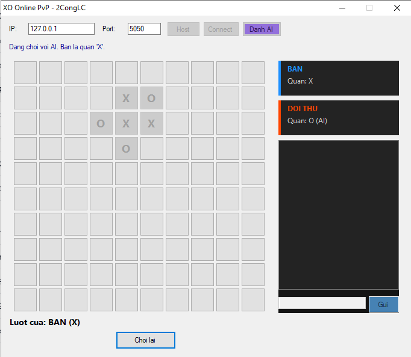

# XO Online (Caro 10x10)

<p align="center">
  
</p>

Trò chơi Cờ Caro (Gomoku/XO kiểu 5-nối) trên bàn cờ 10x10, hỗ trợ chơi
đơn chống AI hoặc PvP 2 người qua mạng LAN/Online. Kiến trúc
peer-to-peer (`NetworkPeer.vb`), Host giữ vai trò quân X và đi trước,
đồng bộ nước đi trực tiếp giữa 2 máy.

# Các tính năng chính
- **Chế độ PvAI**: 1 người chơi đấu với máy, AI tính điểm theo tấn công/phòng thủ
- **Chế độ PvP LAN/Online**: 2 người chơi qua kết nối Host/Client
- Bàn cờ **10x10**, thắng khi có **5 quân liên tiếp** (ngang, dọc, hoặc chéo)
- Khung **card thông tin** hiển thị quân cờ của bản thân và đối thủ
- Khung **chat** trực tiếp giữa 2 người chơi (không dùng khi đấu AI)
- Nút **Chơi lại** đồng bộ ván mới cho cả 2 máy

# Điều kiện thắng
- Đủ **5 quân cùng ký hiệu (X hoặc O) liên tiếp** theo 1 trong 4 hướng
  (ngang, dọc, chéo `\`, chéo `/`) → **Thắng**
- Bàn cờ đầy mà không ai đủ 5 quân liên tiếp → **Hòa**

# Vai trò quân cờ
| Vai trò | Ký hiệu | Đi trước |
|---------|---------|----------|
| Host | X | Có |
| Client | O | Không |
| AI (khi chơi PvAI) | O | Không |

# Điều khiển
- Dùng **chuột trái** để đánh vào ô trống trên bàn cờ
- Gõ tin nhắn vào khung chat rồi bấm **Gửi** hoặc **Enter** để trò chuyện (chế độ PvP)

# Cách build
Yêu cầu: **.NET Framework 4.x** đã cài sẵn trên Windows.

```
buildexe_xo.bat
```

File `.exe` xuất ra cùng thư mục với tên `XOOnline.exe`.

# Cách chơi

**PvAI:**
1. Chọn **Danh AI** → bắt đầu ngay, bạn là quân **X**
2. Nhấp chuột vào ô trống để đánh
3. Đủ 5 quân liên tiếp trước AI để thắng

**PvP LAN/Online:**
1. Máy Host nhập Port → bấm **Host** → chờ kết nối
2. Máy Client nhập IP của Host và Port tương ứng → bấm **Connect**
3. Host đi quân X trước, Client đi quân O sau
4. Dùng khung chat bên phải để trò chuyện trong lúc chơi
5. Bấm **Chơi lại** để bắt đầu ván mới (đồng bộ cho cả 2 máy)

# Cấu trúc file
| File | Vai trò |
|------|---------|
| `XOOnline.vb` | Toàn bộ logic game: giao diện, bàn cờ, luật thắng, AI, chat, card người chơi |
| `NetworkPeer.vb` | Kết nối mạng TCP giữa Host và Client |
| `buildexe_xo.bat` | Script build bằng vbc.exe |
